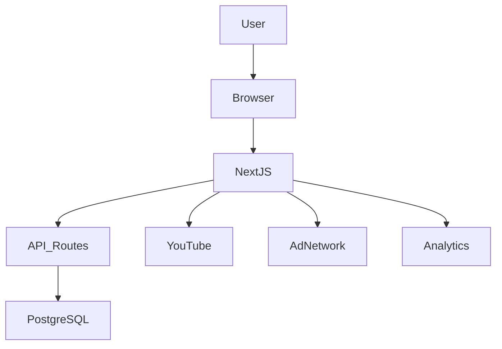
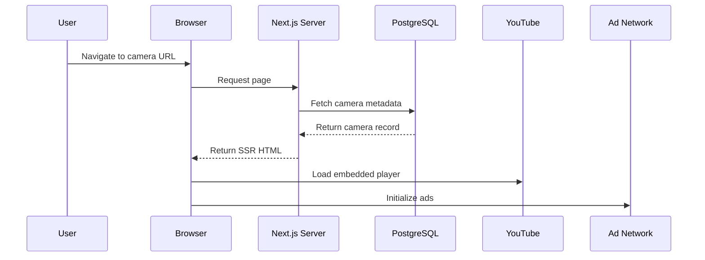
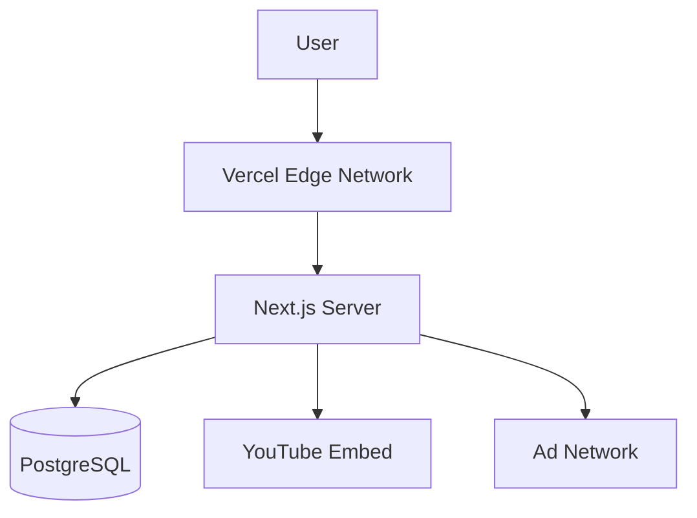
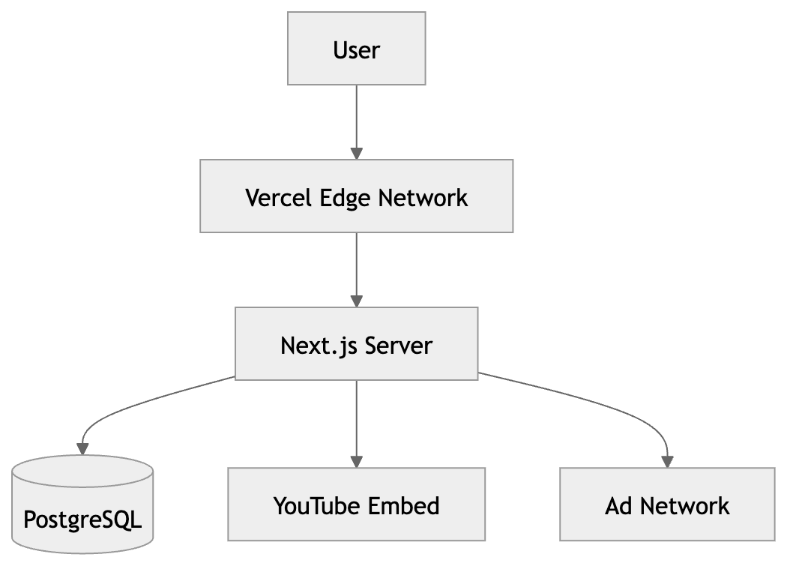

# Chapter 3 — System Architecture Design

## 3.1 Architectural Vision

The product launches as a Greece-first live webcam SaaS platform.

However, from the beginning, the architecture is designed for:

- Multi-country expansion
- High SEO scalability
- Traffic growth
- Monetization layering
- Infrastructure resilience

The system follows a startup engineering principle:

> Narrow initial scope. Globally scalable foundation.

The architecture prioritizes simplicity in version 1, while avoiding structural debt.

---

## 3.2 Technology Stack

The chosen stack:

- Next.js (App Router)
- TypeScript
- React
- PostgreSQL (via Supabase or Neon)
- Prisma ORM
- Deployment on Vercel
- YouTube Embedded Player (official embed)
- Ad Network (AdSense / future Ad Manager)

This stack allows:

- Full-stack TypeScript
- Server-side rendering
- Clean API route integration
- Managed database scaling
- Minimal DevOps overhead

---

## 3.3 High-Level System Architecture

## Component Breakdown

### Client Layer

- React components
- YouTube embedded player
- Ad scripts
- Analytics tracking

### Application Layer (Next.js)

- Server-side rendering (SSR)
- Dynamic routing
- Metadata generation
- API route handlers

### Data Layer

- PostgreSQL database
- Indexed queries
- Categorization tables

### External Services

- YouTube embed
- Ad network
- Analytics provider

## 3.4 Request Lifecycle (Camera Page)

When a user visits:

/greece/athens/monastiraki-live-cam

The system executes the following sequence:

### Step-by-Step Explanation

The user navigates to a dynamic camera route.

The browser sends a request to the Next.js server.

The server queries PostgreSQL for camera metadata.

The server renders the page using server-side rendering (SSR).

The browser loads the YouTube embedded player.

Advertising scripts initialize client-side.

This hybrid model ensures SEO visibility while keeping streaming external.

## 3.5 SSR vs CSR Strategy

The rendering strategy directly impacts discoverability and performance.

### Option A — Client-Side Rendering (CSR)

Pros

Simpler implementation

Pure React workflow

Cons

Weak SEO performance

Delayed metadata rendering

Slower indexation by search engines

### Option B — Server-Side Rendering (SSR)

Pros

Search engine optimized

Metadata generated server-side

Faster first meaningful paint

Shareable OpenGraph previews

Cons

Slightly increased server workload

Final Decision

Server-side rendering (SSR) is required.

This product depends on organic search traffic.
SEO is not an enhancement — it is a core acquisition strategy.

## 3.6 Database Architecture (PostgreSQL)

The data layer uses PostgreSQL via:

Supabase (managed Postgres)

or Neon (serverless Postgres)

The schema is designed for global scalability from the beginning.

Core Entity: Camera

Fields include:

id (UUID)

title

slug

country

region

city

category

youtubeUrl

description

createdAt

updatedAt

Indexing Strategy

Indexes will be created on:

country

city

slug

category

This ensures efficient filtering and fast route resolution.

## 3.7 Deployment Architecture

The deployment stack:

- Vercel (application hosting)
- Managed PostgreSQL (Supabase or Neon)
- Edge CDN via Vercel

### Why Vercel?

- Native Next.js optimization
- Automatic scaling
- Preview deployments

Minimal DevOps configuration

This setup allows fast iteration without infrastructure complexity.

### 3.8 Caching Strategy

To reduce database pressure and improve performance:

Static generation for city-level pages

Incremental Static Regeneration (ISR)

CDN caching for static assets

Lazy loading for embedded players

YouTube streams are not hosted internally, which eliminates bandwidth costs.

### 3.9 Legal & Streaming Constraints

The MVP explicitly avoids:

Re-hosting video streams

Downloading YouTube content

Scraping copyrighted sources

Operating proprietary IP camera infrastructure

Only the official YouTube embed player is used.

This decision eliminates:

Infrastructure risk

Legal exposure

CDN streaming expenses

### 3.10 Scalability Roadmap

Phase 1 — Greece
Phase 2 — Mediterranean Expansion
Phase 3 — European Expansion
Phase 4 — Global Aggregation

Because country is embedded into the schema, expansion requires:

Data population

SEO scaling

Infrastructure tuning

No architectural redesign is necessary.

### 3.11 Architecture Summary

The system architecture prioritizes:

SEO-driven growth

Clean separation of concerns

Minimal infrastructure complexity

Managed database scaling

Legal-safe streaming

Global scalability from day one

This reflects startup engineering discipline rather than experimental overengineering.
