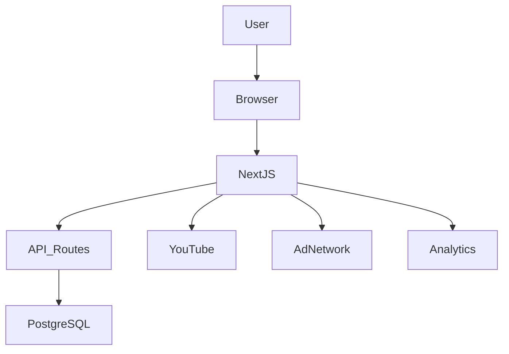

# Chapter 3 — System Architecture Design

## 3.1 Architectural Vision

The product launches as a Greece-first live webcam SaaS platform.

However, from the beginning, the architecture is designed for:

- Multi-country expansion
- High SEO scalability
- Traffic growth
- Monetization layering
- Infrastructure resilience

The system follows a startup engineering principle:

> Narrow initial scope. Globally scalable foundation.

The architecture prioritizes simplicity in version 1, while avoiding structural debt.

---

## 3.2 Technology Stack

The chosen stack:

- Next.js (App Router)
- TypeScript
- React
- PostgreSQL (via Supabase or Neon)
- Prisma ORM
- Deployment on Vercel
- YouTube Embedded Player (official embed)
- Ad Network (AdSense / future Ad Manager)

This stack allows:

- Full-stack TypeScript
- Server-side rendering
- Clean API route integration
- Managed database scaling
- Minimal DevOps overhead

---

## 3.3 High-Level System Architecture

